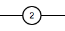
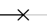
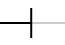
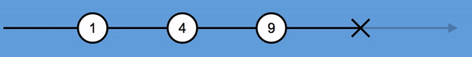

# Formation RxJS

https://slides.com/mania06/rxjs

## Résumé

* Présentation RxJS, contexte, utilité, pourquoi
* Observable
    * Représentation (marbles)
    * Définition
        * Next
        * Error
        * Complete
    * Ecouter observable
    * Créer un Observable
        * new Observable();
        * from
        * of
        * interval
        * throwError
        * NEVER
        * EMPTY
* Subscription
    * Unsubscription with example
    * Différence hot/cold: https://medium.com/@benlesh/hot-vs-cold-observables-f8094ed53339
* Operators

## Introduction RxJS

### RxJS c'est génial !
* Uniformise la gestion des evenements asynchrones dans une application (Promises, callback, DOM inputs, Web Sockets, ...)
* Librairie puissante qui permet de combiner des evenements
* C'est utilisé par des gros framework (Angular, React/Redux)
* C'est en train de devenir un standard

### RxJS c'est quoi ?
RxJS = librairie de reactive programming. Sert à manipuler un flux (= Observable)

### Un Observable, c'est quoi?
#### Elements atomiques
Un observable est composé de 3 type d'éléments

##### Une ou plusieur valeur

##### Une erreur

##### Une fin (completion)

#### Examples
Voici 2 examples d'Observable:
* Un Observable qui envoie 4 valeurs et qui se finit

* Un Observable qui envoie 3 valeurs et qui emet une erreur

